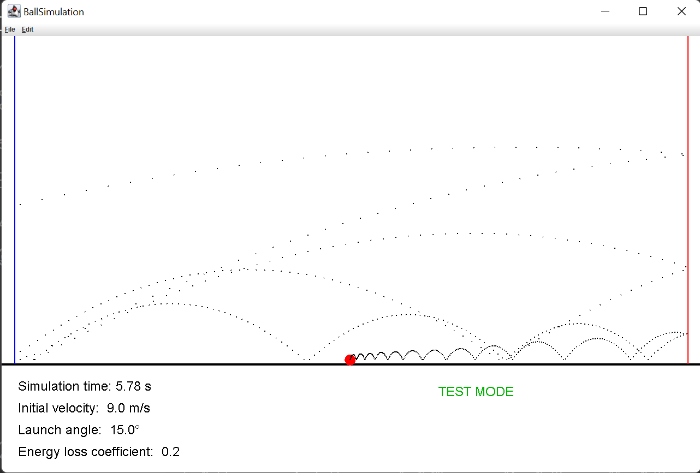
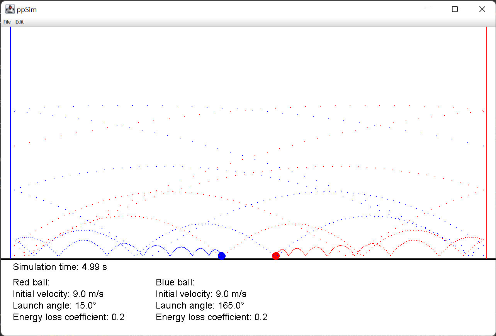
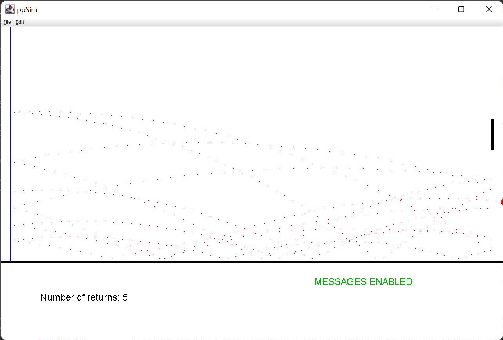
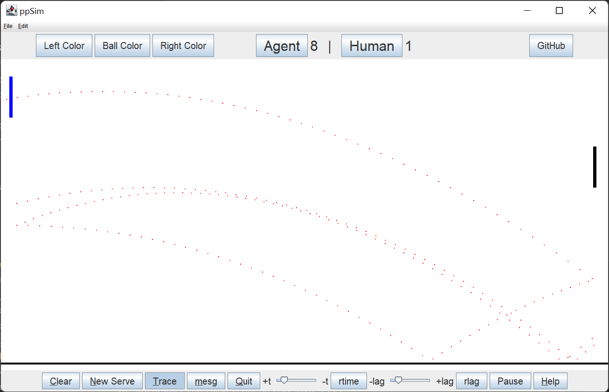

# Pong

A compilation of projects leading up to a recreation of the *Pong* game using
the Java Task Force's `acm` package.

## 1. Simulation of a bouncing ping-pong ball (procedural)

This part of the project is a GUI application that simulates a bouncing ping-pong ball. The program takes three inputs: the ball's initial velocity, direction, and the energy loss parameter.

## 2. Simulation of a bouncing ping-pong ball using Object-Oriented Programming

In this part of the project, the goal was to recreate the program written
in the first part, but using an Object-Oriented Programming approach. This
will facilitate the next projects, as the classes will be already written
and will only have to be modified slightly.

Using OOP also allows for multiple balls bouncing at the same time, which was
impossible in the way that the first program was written.

## 3. Simulation of a ping-pong ball with a paddle

Now, in addition to the bouncing ping-pong ball, the right wall is replaced
by a movable paddle. The paddle follows the user's mouse movement. It is
essentially just like the full game of pong, except that the player plays
alone, against a "wall".

## 4. Full game

The full games features many improvements over the version from assignment 3.
The left wall is now also a paddle, controlled by the computer. Many buttons
and sliders have been added, which control the speed of the game, the computer's
paddle's movement "lag", the colors of the ball and paddles, etc.

